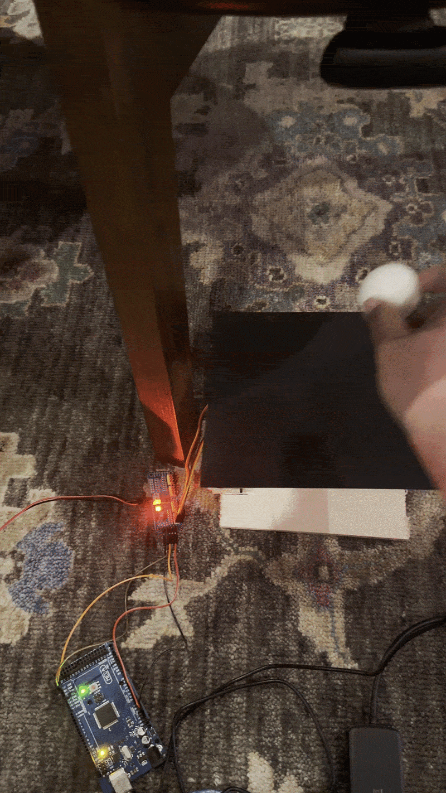

# Vision-Based Ball Balancing Platform

A ball-balancing platform I built that uses a camera, OpenCV, PID control, and two servos to keep a ball near the center.

## Demo

[Watch the full demo video](media/DemoVideo.MOV)

### Quick Preview

### Photos

## How It Works

Camera → Python/OpenCV → Ball Position → PID Controller → Arduino → Servos → Platform

A USB camera tracks the ball using OpenCV and determines its position relative to the center of the platform. The program converts that position into X- and Y-axis error values, then uses a PID control loop to calculate how much the platform should tilt in each direction. Those commands are sent to the Arduino, which adjusts the two servos to move the ball back toward the center. Position filtering and a small dead zone are also used to reduce noise and unnecessary servo movement.

## Hardware

- Arduino Mega 2560
- PCA9685 servo controller
- Two servo motors
- USB camera
- Custom platform and linkage
- Raspberry Pi — used to test running the vision and control software on-device

## Software

- Python
- OpenCV
- Arduino/C
- PID control

## What I Worked On

- Tuned the PID control to reduce oscillation
- Filtered noisy camera measurements
- Adjusted servo speed and travel limits
- Changed the platform and linkage geometry to improve stability
- Tested different control settings to make the system respond better to disturbances

## Project Files

- `balancing_ball_controller.py` — camera tracking and PID control
- `ball_balancing_arduino.ino` — Arduino servo control
- `media/` — photos and demo videos
