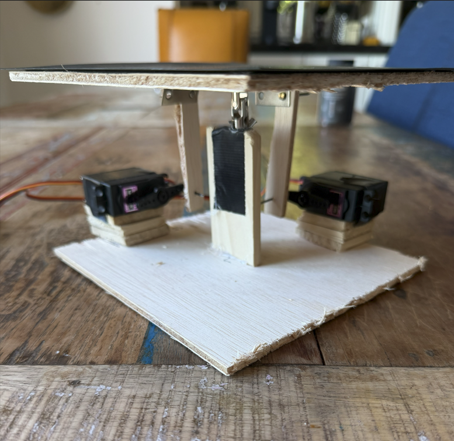
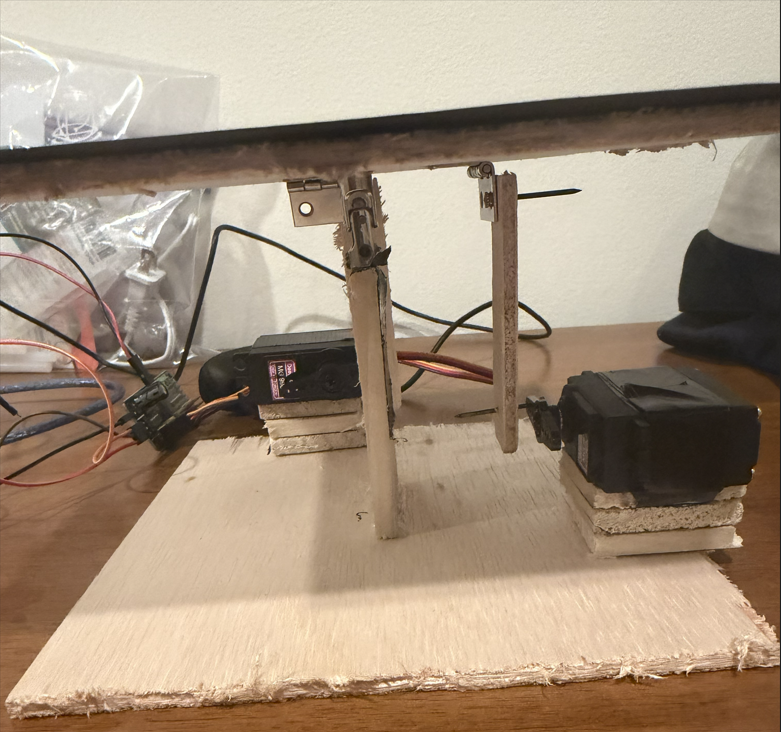
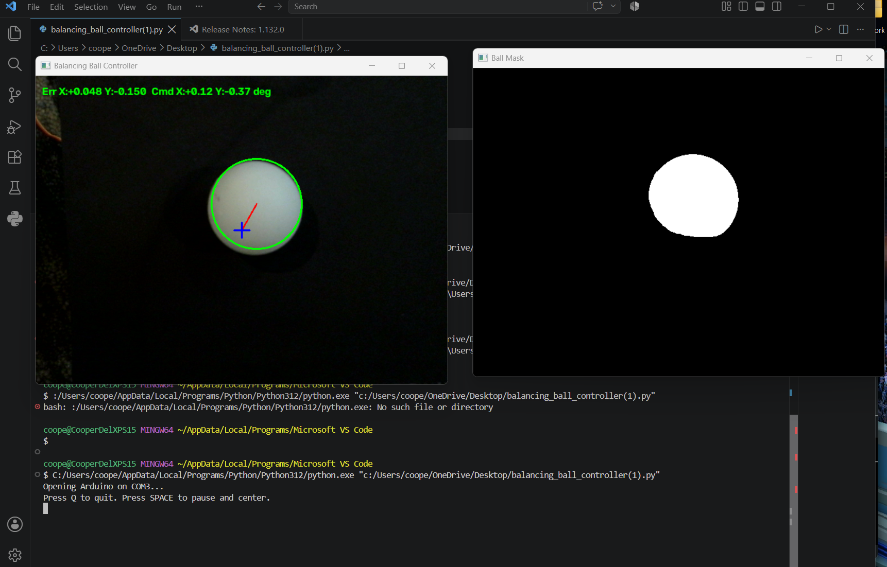

# Vision-Based Ball Balancing Platform

A ball-balancing platform I built that uses a camera, OpenCV, PID control, and two servos to keep a ball near the center.

## Demo

[Watch the full demo video](media/DemoVideo.MOV)

### Photos

## How It Works

Camera → Python/OpenCV → Ball Position → PID Controller → Arduino → Servos → Platform

A USB camera tracks the ball using OpenCV. The program calculates how far the ball is from the center of the platform, then uses a PID control loop to decide how much the platform should tilt. The Arduino receives those commands and controls the two servos.

## Hardware

- Arduino Mega 2560
- PCA9685 servo controller
- Two servo motors
- USB camera
- Custom platform and linkage
- Raspberry Pi — used to test running the vision and control software on-device

## Software

- Python
- OpenCV
- Arduino/C
- PID control

## What I Worked On

- Tuned the PID control to reduce oscillation
- Filtered noisy camera measurements
- Adjusted servo speed and travel limits
- Changed the platform and linkage geometry to improve stability
- Tested different control settings to make the system respond better to disturbances

## Project Files

- `ball_control.py` — camera tracking and PID control
- `arduino_control.ino` — servo control
- `media/` — photos and demo videos
